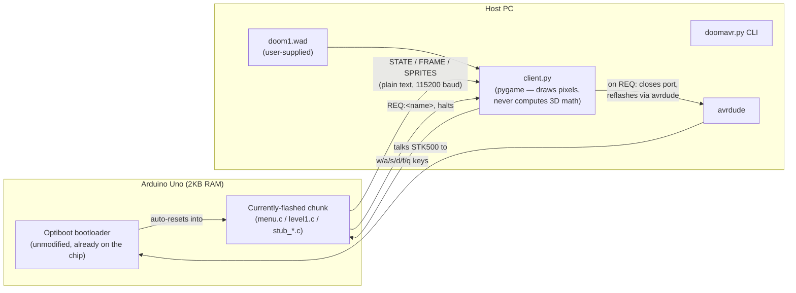
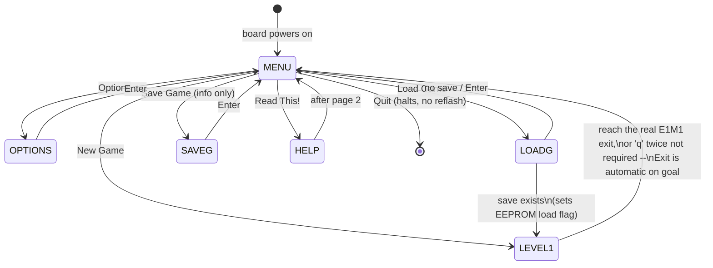

# Architecture

*doom-avr is an artfical project — Copyright (C) 2026 Talha Berk Arslan — AGPL-3.0-or-later, see [LICENSE](LICENSE).*

This document explains how doom-avr actually works: the dynamic binary-loading mechanism, the on-chip raycaster, the wire protocol between the Arduino and the host, and the EEPROM-backed save/settings system. Every claim here was verified live on real hardware during development — see `doom_avr_project` build history for the raw test transcripts if you want the receipts, not just the summary.

## Why not the Arduino IDE / `.ino` sketches?

Deliberately, not an oversight. A `.ino` sketch compiles against the Arduino core library, which pulls in a `setup()`/`loop()` wrapper, `Serial` (a buffered, interrupt-driven UART wrapper with its own RAM overhead), and various other conveniences — all of which cost SRAM on a chip that only has **2KB total**. This project instead compiles bare C against `avr-libc` directly with `avr-gcc`, writing UART registers by hand (see `avr/src/common_uart.h`). That difference is why a chunk like `level1.c` — real E1M1 geometry, on-chip raycasting, enemies, combat, EEPROM save/load — fits in about 800 bytes of RAM with room to spare, instead of not fitting at all.

## The hardware constraint that shapes everything

ATmega328P (Arduino Uno): **2KB SRAM, 32KB flash, 16MHz, no FPU**. A single 320×200 8-bit framebuffer — the thing chocolate-doom (and every other source port) assumes exists — is 64,000 bytes. That's 31× more RAM than the entire chip has. Every architectural decision below exists because of that one fact.

## System overview



**The chip never receives streamed chunk data over the running connection.** A chunk that needs to swap out sends `REQ:<name>` and halts. The host closes its serial connection, shells out to `avrdude` (talking to the Optiboot bootloader that's already on every Uno — no custom self-programming code), reflashes the whole chip with the requested `.bin`, then reopens the connection. The chip's own auto-reset (DTR toggle, the same mechanism the Arduino IDE uses) brings up the new chunk. This was a deliberate pivot away from an earlier plan involving custom AVR self-programming (`SPM`) — reusing a bootloader that's already reliable is safer than hand-rolling flash-write code.

## Chunk lifecycle



Every arrow is a full chip reflash except "Quit", which is handled entirely locally (no REQ, no reflash — the chunk just prints a message and halts).

## On-chip rendering

The Arduino computes the actual 3D math — not just game state. For each of 16 screen columns, `level1.c`'s `cast_ray()` finds the nearest of 404 real E1M1 wall segments (parsed straight out of `doom1.wad`'s LINEDEFS/VERTEXES by `tools/gen_map.py`), corrects for fisheye distortion, and streams the result as compact text:

```
FRAME:d0:w0:f0,d1:w1:f1,...     — per column: distance : wall-index : texture-hit-fraction
SPRITES:E12:c:d,I3:c:d,...      — visible enemies/items: type+index : column : distance
STATE:x,y,angle,kills,pickups,health
```

`client.py` never does an intersection test — it looks up `wall_index` in `host/map_data.py` (generated from the same WAD data, so it can't drift out of sync with the firmware's copy), samples the real composited WAD texture, and draws the pixel column. The host is a "display driver" for data the chip already decided, not the renderer itself. There's no physical display wired up (yet) — the host's window is where the pixels currently land, but the math that decided what those pixels *are* happened on-chip.

**Performance tuning, all measured on real hardware, not estimated:**

| Version | Frame time |
|---|---|
| 32 columns, `atan2f`-based sprite visibility | ~4.1s (later distrusted timing method) |
| 32 columns, dot-product sprite visibility (no `atan2f`) | 2.93s |
| 20 columns | 1.88s |
| 20 columns + once-per-frame "behind player" wall reject | 1.385s |
| 20 columns + tight FOV-cone wall reject | 0.985s |
| **16 columns, same filters (current)** | **0.83s** |

Bottleneck at every stage was the wall-casting inner loop (404 segments × columns × ~2 float divisions each) — AVR has no hardware floating-point unit, so every division is a software routine. The candidate-list prefilter (`send_frame()` in `level1.c`) computes once per frame, not once per ray, which wall segments could possibly be hit by *any* column this frame, cutting the expensive per-ray work down to the ~80–115 that actually matter for a given view.

## EEPROM: the cross-chunk memory

Program flash gets **completely overwritten** on every reflash, and RAM resets on every reboot. EEPROM (1KB, untouched by flashing) is the only thing that survives a chunk swap, so it doubles as a message-passing channel between chunks that would otherwise have no way to talk to each other. Layout (`avr/src/savegame.h`):

| Bytes | Field |
|---|---|
| 0 | magic byte (save exists?) |
| 1 | one-shot "load requested" flag |
| 2–8 | saved x, y, angle, health |
| 9–12 | saved kills, pickups |
| 13–28 | enemy-alive bitset (16 bytes, room for 128 enemies) |
| 29–44 | item-collected bitset (16 bytes, room for 128 items) |
| 45–46 | turn-speed / move-speed setting indices |

**Load Game** sets the flag and byte-blobs the last save, then REQs `LEVEL1.BIN`; `level1.c` checks that flag at its own boot, restores state, and clears the flag (one-shot, so a later plain "New Game" doesn't silently resume an old save). **Options** writes the two speed indices directly; `level1.c` reads them into runtime `move_step`/`rotate_step` variables at boot instead of using fixed constants.

## Repository layout

```
wad/doom1.wad          you supply this (see README's Licensing section)
tools/gen_map.py        parses real E1M1 map data out of the WAD -->
avr/src/map_data.h        PROGMEM wall/enemy/item geometry, generated
host/map_data.py          matching geometry + sprite/texture names, generated
avr/src/common_uart.h   hand-rolled UART (no Arduino core)
avr/src/savegame.h      EEPROM layout + helpers, shared by several chunks
avr/src/menu.c          chunk: main menu
avr/src/level1.c        chunk: real E1M1, raycasting, combat, save/load
avr/src/stub_options.c  chunk: real settings (despite the filename)
avr/src/stub_loadg.c    chunk: real load
avr/src/stub_saveg.c    chunk: informational (see EEPROM section above)
avr/src/stub_readthis.c chunk: real HELP1/HELP2 WAD screens
avr/build.sh            builds every chunk into host/chunks/*.BIN
host/wad.py             WAD lump reader + patch/texture decoder
host/client.py          the host: renders real WAD graphics from data
                         the Arduino computes, drives avrdude reflashes
doomavr.py              CLI wrapping all of the above (see README)
```
