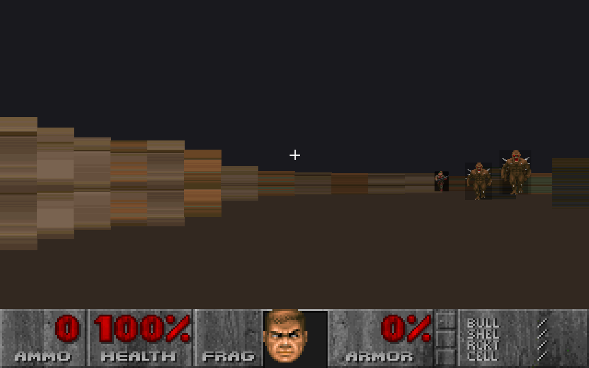
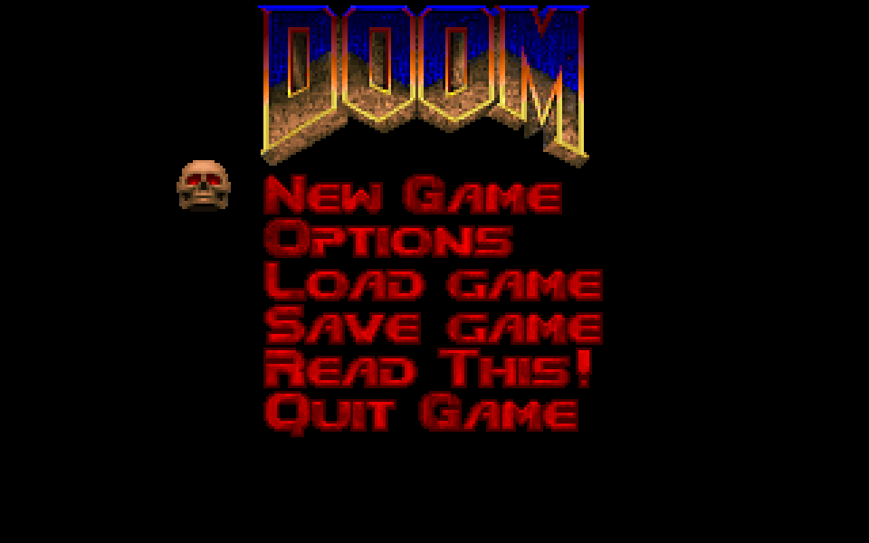
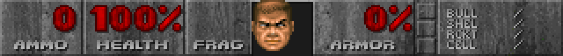
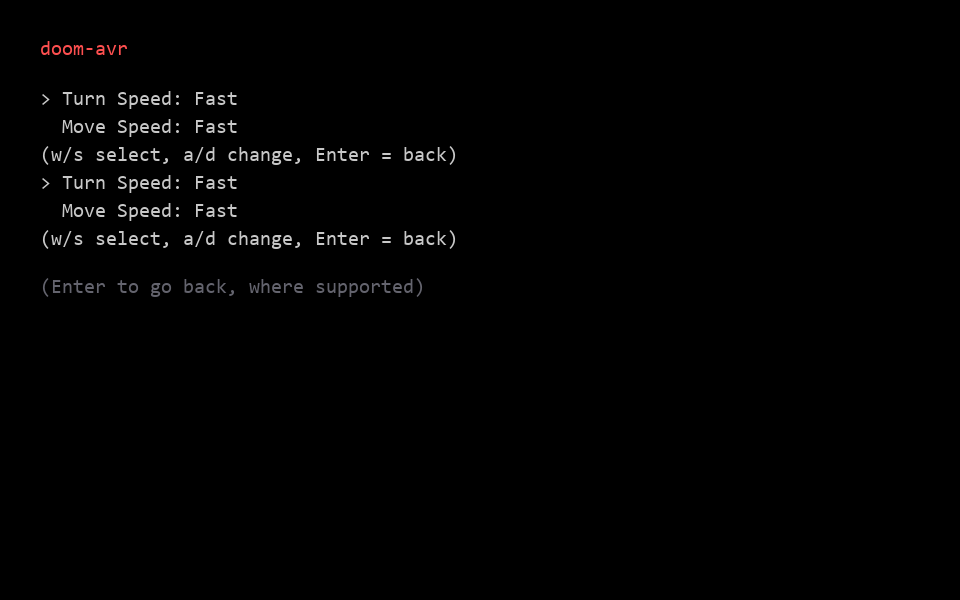
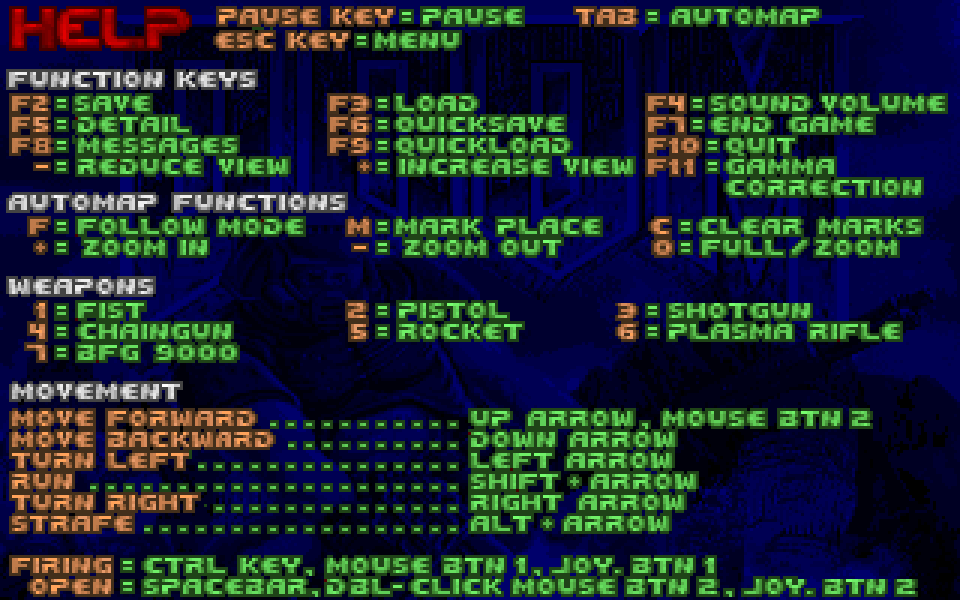
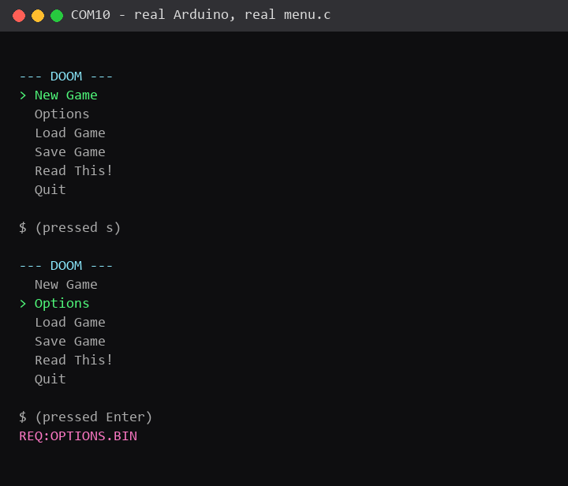

# doom-avr

*doom-avr is an artfical project*
Copyright (C) 2026 Talha Berk Arslan — licensed under the **GNU Affero General Public License v3.0 or later**. See [LICENSE](LICENSE) for the full text and the [Licensing](#licensing) section below for how that applies to the parts of this repo that aren't originally ours.



DOOM, ported to an Arduino Uno (ATmega328P — 2KB SRAM, 32KB flash), using a dynamic binary-loading architecture: the game is split into independently-compiled AVR chunks (menu, a real playable level, stubs for the rest), and the Arduino requests, receives, flashes, and runs each one on demand over serial.

This is a real, working, thoroughly-tested project, not a proof-of-concept sketch — see [Status](#status) for exactly what runs on real hardware today and what's still a documented simplification.

## Install dependencies

**1. The AVR toolchain** (`avr-gcc` + `avrdude` — compiles firmware and flashes the board):

| OS | Command |
|---|---|
| Windows | `winget install ZakKemble.avr-gcc` (bundles both) |
| Debian/Ubuntu | `sudo apt install gcc-avr avr-libc avrdude` |
| macOS (Homebrew) | `brew install avr-gcc avrdude` |

Make sure both `avr-gcc` and `avrdude` end up on `PATH` afterward (`avr-gcc --version` / `avrdude -v` should both run from a fresh terminal). `doomavr.py`/`build.sh` also auto-detect the Windows winget install location as a fallback even if it isn't on `PATH` yet.

**2. Python packages:**

```
pip install -r requirements.txt      # pyserial + pygame
```

**3. The DOOM IWAD** (not bundled — see [Licensing](#licensing)):

```
curl -L -o wad/doom1.wad https://distro.ibiblio.org/pub/linux/distributions/slitaz/sources/packages/d/doom1.wad
```

(the free shareware release, legal to redistribute by id Software's own terms — see [wad/README.md](wad/README.md) for details or if you'd rather point this at a commercial IWAD you already own)

**4. Driver check (Windows + CH340-based clones):** if Device Manager shows the board's driver as failed/missing, install the WCH CH340 driver — Windows doesn't always fetch it automatically. Most genuine Arduino Unos (ATmega16U2-based) don't need this.

## Quickstart

Once the above is done:

```
python doomavr.py ports              # find your board's COM port
python doomavr.py build              # compile every chunk into host/chunks/
python doomavr.py menu COM10         # flash the resting state (main menu)
python doomavr.py run COM10          # launch the graphical host client
```

In the menu: arrow keys / WASD to navigate, Enter to select, mouse click also works.
In-game (New Game): WASD/arrows to move and turn, Space or left-click to fire, `q` to save.

## Screenshots

| Main menu | In-game (E1M1) | Status bar |
|---|---|---|
|  |  |  |

| Options | Read This! | Arduino serial output |
|---|---|---|
|  |  |  |

All of the above are the real client, driven by a real board, over a real serial connection — not mockups. See [ARCHITECTURE.md](ARCHITECTURE.md) for how it works.

## Architecture

Full writeup, diagrams, wire protocol, and EEPROM layout: **[ARCHITECTURE.md](ARCHITECTURE.md)**. Short version:

- The Arduino itself computes the raycast (which wall each screen column hits, at what distance) and streams it as text; the host only samples real WAD textures/sprites and draws the pixels the firmware already decided.
- A chunk that needs to swap out sends `REQ:<name>` and halts; the host reflashes the whole chip via `avrdude`/the board's existing Optiboot bootloader (no custom AVR self-programming code) and reopens the connection.
- EEPROM (the only thing that survives a reflash) doubles as the cross-chunk save/settings channel.

## Status

Real E1M1 geometry (404 solid walls from the actual linedefs), real WAD
textures and sprites, real enemies (103, five monster types) and items (85),
a hitscan weapon, simple chase AI, player health, death/respawn, a
faithful classic DOOM status bar (STBAR + STTNUM digits + STFST face), and
a real EEPROM-backed Options/Save/Load system and Read This! help screens —
all built from data pulled directly out of `doom1.wad`, not invented.

**Documented simplifications**, not bugs:
- Single-height level (two-sided linedefs become open passages; no
  sector/floor/ceiling-height model).
- No shooting-based combat depth: one hitscan hit or one melee touch = one
  kill, unlimited ammo, no weapon switching.
- Enemy "sight" is straight-line distance, not real line-of-sight through
  walls; enemies don't collide with walls while chasing.
- No floor/ceiling texturing (flat shaded colors).
- Frame latency is roughly 0.8s per action — a "press key, brief pause, see
  result" feel, not real-time. (Tuning history, all measured on real
  hardware: naive version ~4.1s/frame → candidate-list prefiltering + column
  count tuning → 0.83s/frame.)

## Requirements

- Arduino Uno or clone (this project was built/tested against a CH340-based clone).
- Python 3.12+.
- Everything else (toolchain, Python packages, the WAD) — see
  [Install dependencies](#install-dependencies) above.

## Licensing

This is a **from-scratch reimplementation** — the AVR firmware, the host
client, the WAD/map-data tooling, and this CLI are original code written for
this project, and that original code is licensed **AGPL-3.0-or-later** (see
[LICENSE](LICENSE)). Every source file carries an SPDX header saying so.

Two things in this repo are explicitly **not** covered by that license,
because they aren't ours:

- **`chocolate-doom/`**, if you've cloned it alongside this repo, is
  [chocolate-doom](https://github.com/chocolate-doom/chocolate-doom), used
  here purely as a **read-only behavioral/layout reference** (menu item
  order, status bar pixel coordinates, etc.) — never compiled, linked, or
  distributed as part of this project. It remains under its own GPL-2.0
  license from its own authors.
- **`wad/doom1.wad`** (or whatever IWAD you point this at) is id Software's
  copyrighted game data. It is **not included or redistributed** by this
  repository. The shareware `doom1.wad` is freely distributable by id
  Software's own terms; a commercial IWAD is not, and you're responsible for
  only supplying one you're legally entitled to use.

## Credits

- [id Software](https://www.idsoftware.com/) — DOOM
- [Chocolate Doom](https://www.chocolate-doom.org/) — reference for menu
  layout and status bar coordinates
